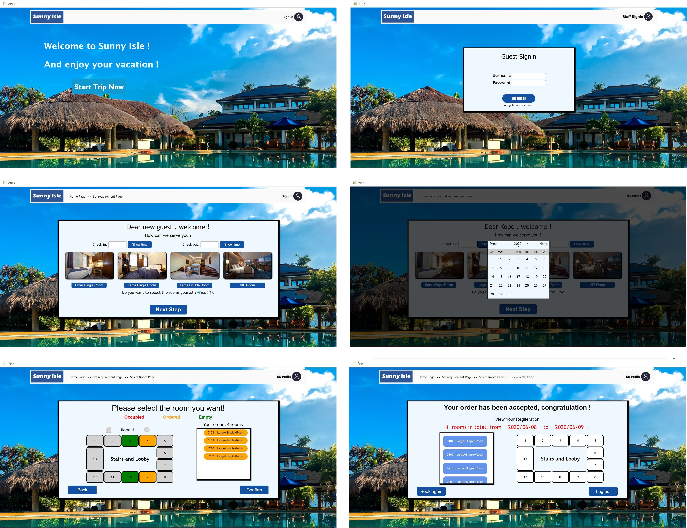
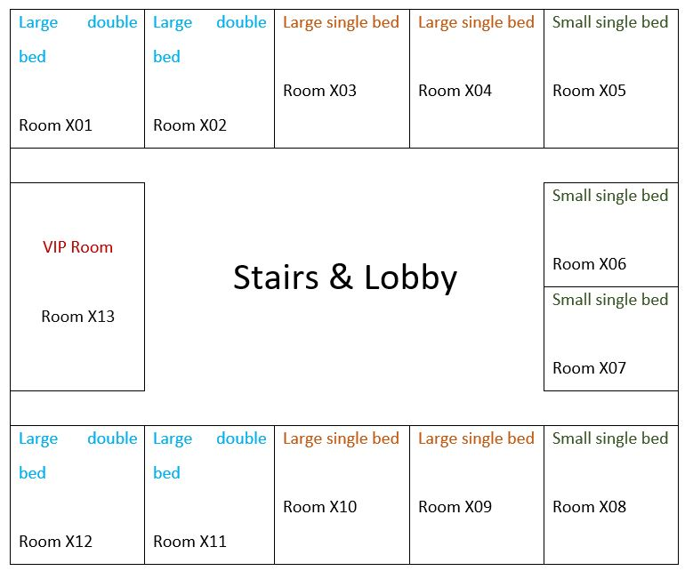

# Sunny-Isle-Hotel-Inn

## Screen Shots

----

## Project Description

Sunny Isle is a small but famous hotel in the east region of Lukewarm Kingdom. People from all over the world visit this place for a nice and comfortable holiday. Due to such popularity, the owner of the hotel decided to expand his hotel and adopt a new hotel management system (HMS) to ease the management process. You are the only one chosen to design and implement this HMS because the manager is not willing to pay more than one person. Apart from that, if you copy any code from others or let someone else develop this HMS, the manager will be disappointed and immediately report this to me. Plagiarism leads to a zero mark for this coursework.

The manager asked you to build a website that provides the following basic functionalities:

1. Allow guests to book rooms or cancel room bookings;

2. Allow hotel staffs to check the status of rooms, including current and future bookings.

You will need to apply all the knowledge that you acquired throughout the DBI course. The deadline is 4 pm on Wednesday, the 15th of May. Late submission will result in 3 marks loss per workday and you cannot submit after 4 pm on Monday, the 20th of May.

This assessment contributes 25% towards the overall module grade. Your submission will be marked on the school’s cslinux server. Subsequently, your code must work on the PHP and MySQL installations on cslinux. “It works on my machine” is not a valid argument when questioning your grade for this assessment. You will also need to include a clear reference document of your website, describing all functionalities.

----

## Core Functionality

Below is the detailed description of the minimum functionality expected in the HMS. You must use this specification to develop the functionality of the system. You may apply your own judgement to any detail that is not precisely specified below.

The website must allow a guest to book a room or cancel a booked room. A registered guest will have a username, guest’s real name, passport ID, telephone number and email address. There is no current requirement for users to be able to update their details, but you may add this functionality if you wish. To log in, a guest is required to input his username and password correctly. Your website must also allow new users to be registered.

Rooms in the Sunny Isle Hotel have four different types:

1.	Large room with double beds.
2.	Large room with a large single bed.
3.	Small room with a single bed.
4.	VIP room.

The plan view of the floors of the hotel is shown above. The room number starts from the room in the top-left and increases clock-wise. For simplicity, all floors of this hotel share the same plan view. The “X” in “Room X01” refers to the floor number. The hotel has 10 floors in total. I used a table to represent this plan view, but you can use any other methods to represent it in HMS.

To book a room, a guest needs to specify the check-in date, check-out date as well as the type of the room. After this, he will be presented with a page that allows him to choose the specific room to stay in. Note that choosing the room number is not a required step for guests. A guest can book multiple rooms for himself and his friends, but he is only allowed to stay in one of the booked rooms when he checks in. One does NOT need to have a user account in the HMS for him to be able to stay in the hotel, but his passport ID must be registered when checking in.

Staffs can view and change the booking status of all rooms inside the Sunny Isle. Each staff account is associated with a username, password, telephone number and staff ID. Staffs should be able to log in through a different entrance of the HMS. When a guest and his friends/family members arrive at the hotel, the staff register them and map their passport IDs to their booked rooms. In HMS, you need to clearly indicate the status of a room for guests and staffs. That is, whether a room is booked, occupied or empty. The staff should be able to see all booked dates of a specific room. For privacy issues, guests only know whether a specific room is available during their intended stay period.
